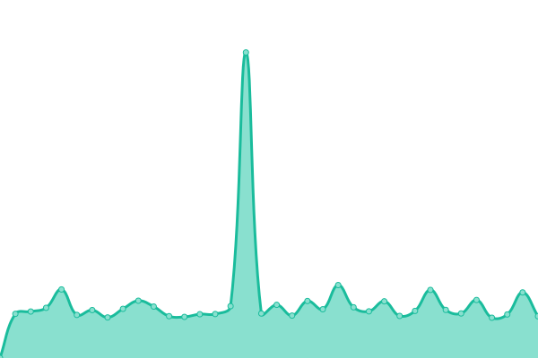
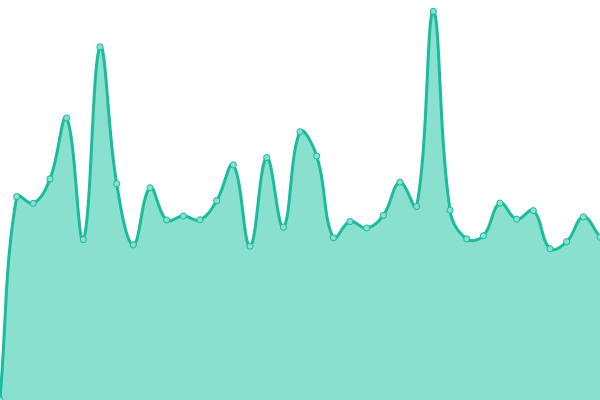

# [📈 Live Status](https://gitsrc.github.io/upptime): <!--live status--> **🟧 Partial outage**

This repository contains the open-source uptime monitor and status page for [GITSRC](https://blog.icorer.com), powered by [Upptime](https://github.com/upptime/upptime).

With [Upptime](https://upptime.js.org), you can get your own unlimited and free uptime monitor and status page, powered entirely by a GitHub repository. We use [Issues](https://github.com/gitsrc/upptime/issues) as incident reports, [Actions](https://github.com/gitsrc/upptime/actions) as uptime monitors, and [Pages](https://gitsrc.github.io/upptime) for the status page.

<!--start: status pages-->
<!-- This summary is generated by Upptime (https://github.com/upptime/upptime) -->
<!-- Do not edit this manually, your changes will be overwritten -->
<!-- prettier-ignore -->
| URL | Status | History | Response Time | Uptime |
| --- | ------ | ------- | ------------- | ------ |
|  [BLOG-WEB](https://blog.icorer.com) | 🟩 Up | [blog-web.yml](https://github.com/gitsrc/upptime/commits/HEAD/history/blog-web.yml) | 

 1030ms
     
 | 

<a href="https://health.icorer.com/history/blog-web">100.00%</a>
    

|  [MSP-002](https://msp-portal.gw002.oneitfarm.com/) | 🟥 Down | [msp-002.yml](https://github.com/gitsrc/upptime/commits/HEAD/history/msp-002.yml) | 

 817ms
     
 | 

<a href="https://health.icorer.com/history/msp-002">98.77%</a>
    

|  [MSP-103](https://msp-portal.gw103.oneitfarm.com/) | 🟥 Down | [msp-103.yml](https://github.com/gitsrc/upptime/commits/HEAD/history/msp-103.yml) | 

 1141ms
     
 | 

<a href="https://health.icorer.com/history/msp-103">98.80%</a>
    

|  [MSP-106](https://msp-portal.gw106.oneitfarm.com/) | 🟩 Up | [msp-106.yml](https://github.com/gitsrc/upptime/commits/HEAD/history/msp-106.yml) | 

 1315ms
     
 | 

<a href="https://health.icorer.com/history/msp-106">100.00%</a>
    

<!--end: status pages-->

[**Visit our status website →**](https://gitsrc.github.io/upptime)

## 📄 License

- Powered by: [Upptime](https://github.com/upptime/upptime)
- Code: [MIT](./LICENSE) © [GITSRC](https://blog.icorer.com)
- Data in the `./history` directory: [Open Database License](https://opendatacommons.org/licenses/odbl/1-0/)
